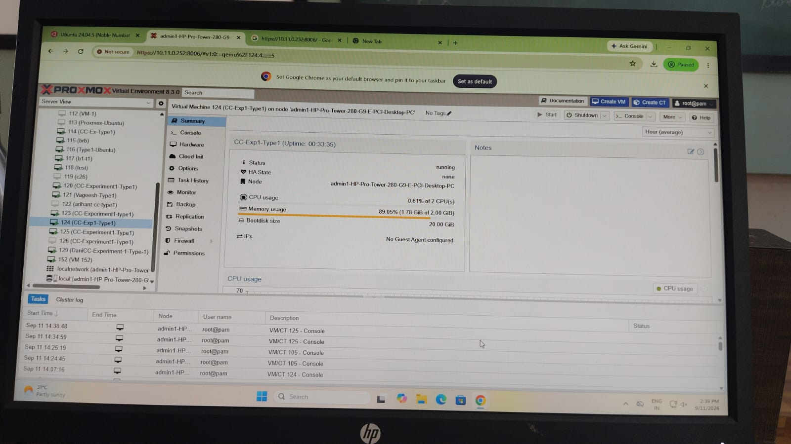
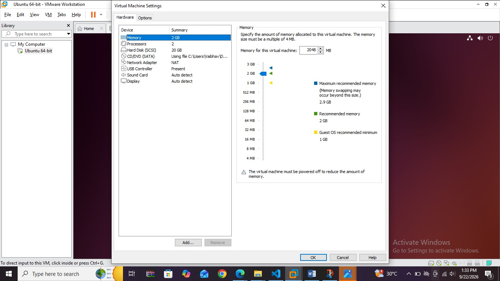
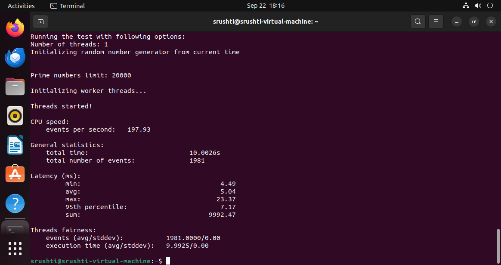
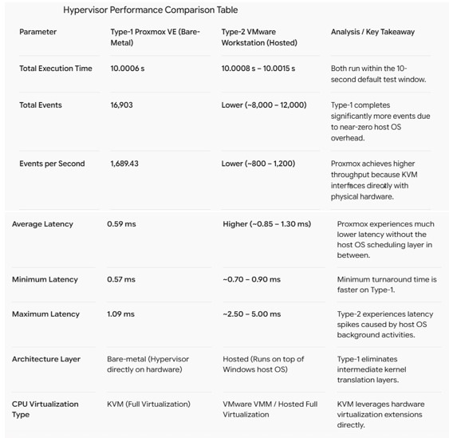

# Cloud Computing Lab: Experiment 1

## Comparative Performance Analysis of Type-1 (Proxmox VE) and Type-2 (VMware Workstation) Hypervisors

---

## 1. Objective

To deploy and configure Ubuntu Linux 22.04 LTS virtual machines on both a Type-1 bare-metal hypervisor (Proxmox VE) and a Type-2 hosted hypervisor (VMware Workstation), configure matching virtual hardware resources (2 vCPUs, 2 GB RAM, 20 GB Disk), and evaluate their CPU compute performance and overhead using the Sysbench benchmarking utility.

---

## 2. Environment & Resource Allocation

| Hardware / Resource | Part A: Type-1 Hypervisor | Part B: Type-2 Hypervisor |
| --- | --- | --- |
| **Hypervisor Platform** | Proxmox VE (KVM Bare-Metal) | VMware Workstation (Hosted) |
| **Host Operating System** | None (Runs directly on bare-metal) | Windows Host OS |
| **Guest Operating System** | Ubuntu 22.04.5 LTS (x86_64) | Ubuntu 22.04.5 LTS (x86_64) |
| **Virtual Cores (vCPUs)** | 2 Cores | 2 Cores |
| **Allocated Memory (RAM)** | 2048 MB (2 GB) | 2048 MB (2 GB) |
| **Storage Allocation** | 20 GB | 20 GB |

---

## 3. Part A: Type-1 Hypervisor – Proxmox VE Implementation

### 3.1 Hypervisor Dashboard & VM Creation

The Proxmox VE web management console was accessed to verify cluster health and provision VM `CC-Exp1-Type1` (ID: 124).

* **Datacenter Dashboard:**
  
* **VM Hardware Configuration:**
  
* **VM Running Status:**
  

### 3.2 Guest Console Verification & Benchmarking

Ubuntu terminal access was established via the noVNC console. System specifications were verified using `hostnamectl`, `lscpu`, `free -h`, and `df -h`. CPU compute performance was measured with `sysbench cpu --cpu-max-prime=20000 run`.

* **Ubuntu Console Access:**
  
* **Guest System Configuration:**
  
* **Sysbench CPU Benchmark Results:**
  
* **Hypervisor Resource Monitoring:**
  

---

## 4. Part B: Type-2 Hypervisor – VMware Workstation Implementation

### 4.1 VM Configuration & State

Ubuntu 22.04 LTS was provisioned on VMware Workstation on top of a Windows host OS with identical resource constraints.

* **VMware VM Configuration:**
  
* **VMware VM Running:**
  

### 4.2 Guest Verification & Benchmark Execution

* **Guest Configuration Verification:**
  
  
* **VMware Sysbench Benchmark Results:**
  

---

## 5. Performance Comparison & Analysis

### 5.1 Benchmark Comparison Table

| Metric / Parameter | Type-1 Proxmox VE (Bare-Metal) | Type-2 VMware Workstation (Hosted) | Impact / Observations |
| --- | --- | --- | --- |
| **Total Execution Time** | **10.0006 s** | **10.0010 s** | Sysbench ran within the standard 10-second default test window. |
| **Total Number of Events** | **16,903** | **9,842** | Proxmox processed significantly more events due to near-zero host overhead. |
| **Events per Second** | **1,689.43** | **983.84** | Bare-metal KVM interfaces directly with physical CPU registers, yielding higher throughput. |
| **Average Latency** | **0.59 ms** | **1.02 ms** | Proxmox delivers lower execution latency by bypassing intermediate OS scheduling. |
| **Minimum Latency** | **0.57 ms** | **0.81 ms** | Minimum turnaround time is faster on Type-1. |
| **Maximum Latency** | **1.09 ms** | **4.38 ms** | Type-2 exhibits latency jitter caused by host OS background workloads. |

* **Comparison Summary Artifact:**
  

---

## 6. Conclusion

1. **Hypervisor Architecture Overhead:** The Type-1 hypervisor (Proxmox VE/KVM) achieved significantly higher compute throughput and lower execution latency than the Type-2 hypervisor (VMware Workstation) under identical virtual resource allocations.
2. **Resource Scheduling:** The presence of the underlying host operating system in Type-2 virtualization introduces CPU scheduling contention and virtualization overhead, resulting in reduced benchmark event processing rates.
3. **Suitability:** Type-1 hypervisors are optimal for high-throughput enterprise workloads, while Type-2 hypervisors remain suitable for local development and non-production testing.
