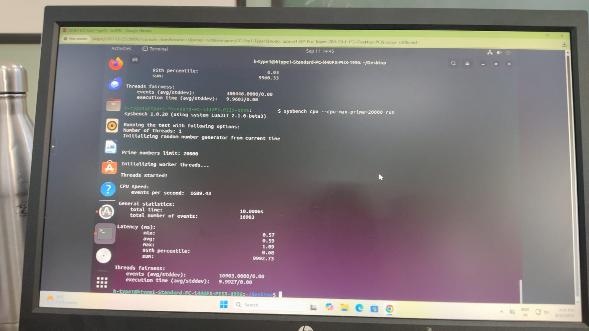
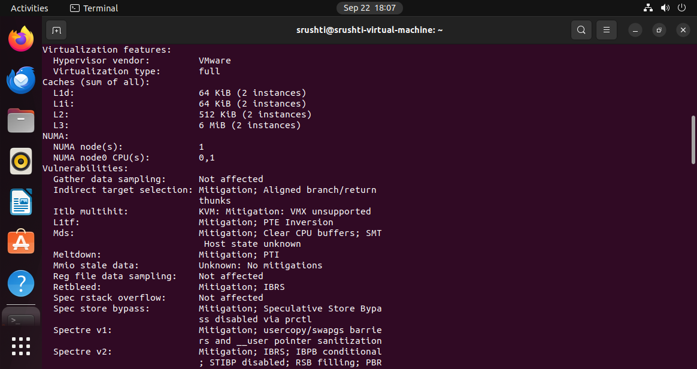
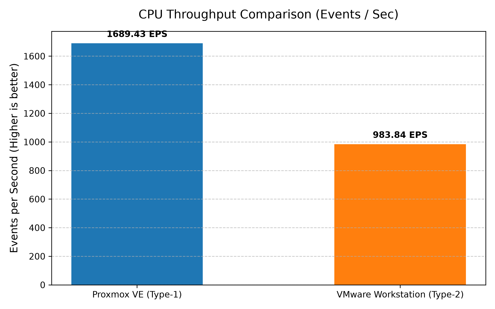
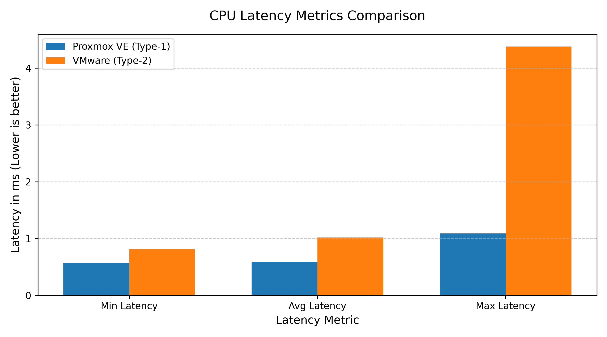
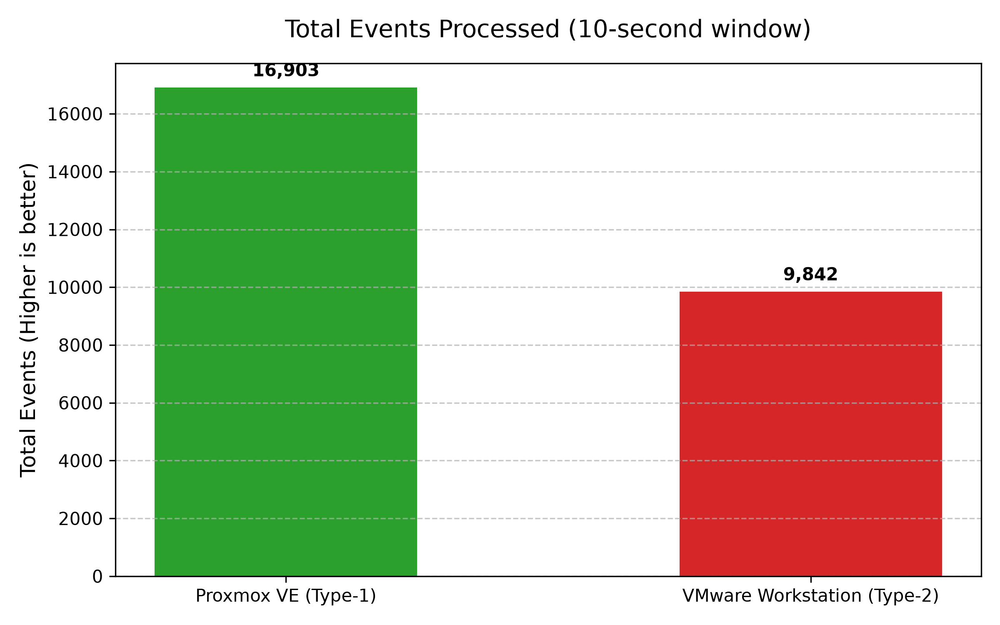
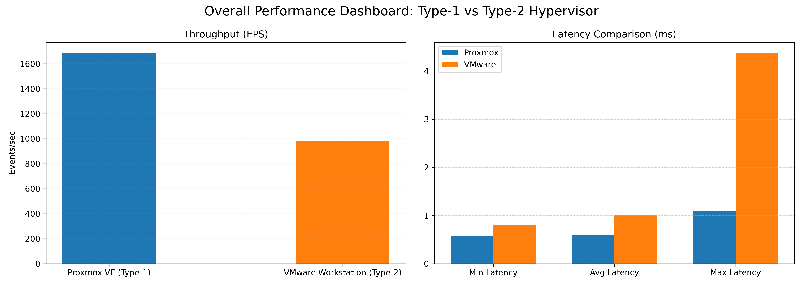

# Cloud Computing Lab – Experiment 1

## Performance Analysis of Type-1 and Type-2 Hypervisors

### Proxmox VE (Type-1) vs VMware Workstation (Type-2)

[](#)
[](#)
[](#)
[](#)

---

## Executive Summary

This repository contains the experimental setup, configuration details, screenshots, benchmark results, and performance comparison of a **Type-1 hypervisor (Proxmox VE)** and a **Type-2 hypervisor (VMware Workstation)**.

Both environments were tested using an Ubuntu virtual machine with the same allocated compute resources:

- 2 vCPU
- 2 GB RAM
- 20 GB virtual disk

The CPU performance of both virtual machines was evaluated using the **Sysbench CPU benchmark**:

```bash
sysbench cpu --cpu-max-prime=20000 run

---

## Table of Contents

1. [Project Objectives](#1-project-objectives)
2. [Hypervisor Architecture](#2-hypervisor-architecture)
3. [Virtual Machine Specifications](#3-virtual-machine-specifications)
4. [Experimental Procedure](#4-experimental-procedure)
5. [Screenshots and Evidence](#5-screenshots-and-evidence)
6. [Performance Results](#6-performance-results)
7. [Performance Visualizations](#7-performance-visualizations)
8. [Metric Explanations](#8-metric-explanations)
9. [Technical Analysis](#9-technical-analysis)
10. [Conclusion](#10-conclusion)
11. [Repository Structure](#11-repository-structure)

---

# 1. Project Objectives

The objectives of this experiment are:

- To understand the difference between Type-1 and Type-2 hypervisors.
- To configure an Ubuntu virtual machine on Proxmox VE and VMware Workstation.
- To verify the CPU, memory, storage, and system configuration of each virtual machine.
- To run the same Sysbench CPU benchmark in both environments.
- To record and compare benchmark performance metrics.
- To analyze the effect of the hypervisor architecture on virtual machine performance.
---

# 2. Hypervisor Architecture

## 2.1 Type-1 Hypervisor – Proxmox VE

Proxmox VE uses KVM-based virtualization and operates directly on the physical host hardware.

```text
+-------------------------------------------------------------+
|                 Ubuntu Virtual Machine                      |
|                                                             |
|                 Sysbench CPU Benchmark                      |
+-------------------------------------------------------------+
|                  Proxmox VE / KVM                           |
|                  Type-1 Hypervisor                          |
+-------------------------------------------------------------+
|                  Physical Host Hardware                     |
|                    CPU / RAM / Storage                      |
+-------------------------------------------------------------+
+-------------------------------------------------------------+
|                 Ubuntu Virtual Machine                      |
|                                                             |
|                 Sysbench CPU Benchmark                      |
+-------------------------------------------------------------+
|                  VMware Workstation                         |
|                  Type-2 Hypervisor                          |
+-------------------------------------------------------------+
|                    Host Operating System                    |
+-------------------------------------------------------------+
|                  Physical Host Hardware                     |
|                    CPU / RAM / Storage                      |
+-------------------------------------------------------------+
# 3. Virtual Machine Specifications

| Resource Parameter | Proxmox VE | VMware Workstation |
|---|---|---|
| Hypervisor Type | Type-1 | Type-2 |
| Guest OS | Ubuntu | Ubuntu |
| CPU | 2 vCPU | 2 vCPU |
| Memory | 2 GB | 2 GB |
| Virtual Disk | 20 GB | 20 GB |
| Network | vmbr0 | NAT |
| Benchmark | Sysbench CPU | Sysbench CPU |
| Prime Limit | 20,000 | 20,000 |

---
# 4. Experimental Procedure

## 4.1 System Verification

The following commands were used inside the Ubuntu virtual machines:

```bash
hostnamectl
lscpu
free -h
df -h
top
sudo apt update
sudo apt install sysbench -y
sysbench --version
sysbench cpu --cpu-max-prime=20000 run
# 5. Screenshots and Evidence

## 5.1 Proxmox VE – Type-1 Hypervisor

### Proxmox Dashboard


### Proxmox VM Configuration


### Proxmox VM Running


### Proxmox Ubuntu Console


### Proxmox System Configuration


### Proxmox Sysbench Result



### Proxmox Resource Monitoring


---
## 5.2 VMware Workstation – Type-2 Hypervisor

### VMware VM Configuration


### VMware VM Running


### VMware System Configuration 1



### VMware System Configuration 2


### VMware Sysbench Result


---
# 6. Performance Results

The Sysbench CPU benchmark produced the following results.

| Metric | Proxmox VE (Type-1) | VMware Workstation (Type-2) |
|---|---:|---:|
| Total Execution Time | 10.0006 s | 10.0010 s |
| Total Events | 16,903 | 9,842 |
| Events per Second | 1,689.43 | 983.84 |
| Average Latency | 0.59 ms | 1.02 ms |
| Minimum Latency | 0.57 ms | 0.81 ms |
| Maximum Latency | 1.09 ms | 4.38 ms |

## Performance Comparison


---
# 7. Performance Visualizations

## Events per Second Comparison



## Latency Comparison



## Total Events Comparison



## Overall Performance Dashboard



---
# 8. Metric Explanations

### Total Execution Time

The total time taken by the Sysbench benchmark to complete its workload.

### Total Events

The total number of benchmark operations completed during the test.

### Events per Second

The number of benchmark operations completed per second.

### Average Latency

The average time required to complete an individual benchmark operation.

### Minimum Latency

The lowest recorded time required to complete an individual operation.

### Maximum Latency

The highest recorded time required to complete an individual operation.

---

# 9. Technical Analysis

The benchmark results show different CPU throughput and latency characteristics between the two virtualization environments.

### Proxmox VE

- Total Events: **16,903**
- Events per Second: **1,689.43**
- Average Latency: **0.59 ms**
- Maximum Latency: **1.09 ms**

### VMware Workstation

- Total Events: **9,842**
- Events per Second: **983.84**
- Average Latency: **1.02 ms**
- Maximum Latency: **4.38 ms**

The measured execution times were nearly identical at approximately 10 seconds for both tests. However, the number of completed events and events-per-second values differed.

The results demonstrate how virtualization architecture and the virtualization stack can affect the observed performance of a CPU-bound workload. These results are specific to the tested hardware, VM configuration, software versions, and benchmark conditions.

---
# 10. Conclusion

This experiment provided a practical comparison between a Type-1 hypervisor, Proxmox VE, and a Type-2 hypervisor, VMware Workstation.

Both environments were configured with Ubuntu virtual machines using 2 vCPU, 2 GB RAM, and a 20 GB virtual disk. The same Sysbench CPU benchmark was executed in both environments to provide a common performance measurement.

The collected results show differences in total events, events per second, and latency measurements between the two environments.

The experiment therefore demonstrates the importance of hypervisor architecture and virtualization configuration when evaluating virtual machine performance.

---
# 11. Repository Structure

```text
cc-records/
│
├── README.md
│
└── CC-Experiment-01-Hypervisor-Analysis/
    │
    ├── images/
    │   ├── 04-vmware-sysbench-result.png
    │   ├── 06-promox-ubantu-sysbench-result.png
    │   ├── events_per_second_comparison.png
    │   ├── latency_comparison.png
    │   ├── overall_performance_dashboard.png
    │   └── total_events_comparison.png
    │
    ├── results/
    │   └── performance-analysis.md
    │
    └── screenshots/
        │
        ├── comparison/
        │   └── 01-hypervisor-performance-comparison.png
        │
        ├── type1-promox/
        │   ├── 01-proxmox-dashboard.png
        │   ├── 02-proxmox-vm-configuration.png
        │   ├── 03-proxmox-vm-running.png
        │   ├── 04-proxmox-ubuntu-console.png
        │   ├── 05-proxmox-system-configuration.png
        │   ├── 06-promox-sysbench-result.png
        │   └── 07-promox-resource-monitoring.png
        │
        └── type2-vmware/
            ├── 01-vmware-vm-configuration.png
            ├── 02-vmware-vm-running.png
            ├── 03-vmware-system-configuration 2.png
            ├── 03-vmware-system-configuration1.png
            └── 04-vmware-sysbench-result.png
